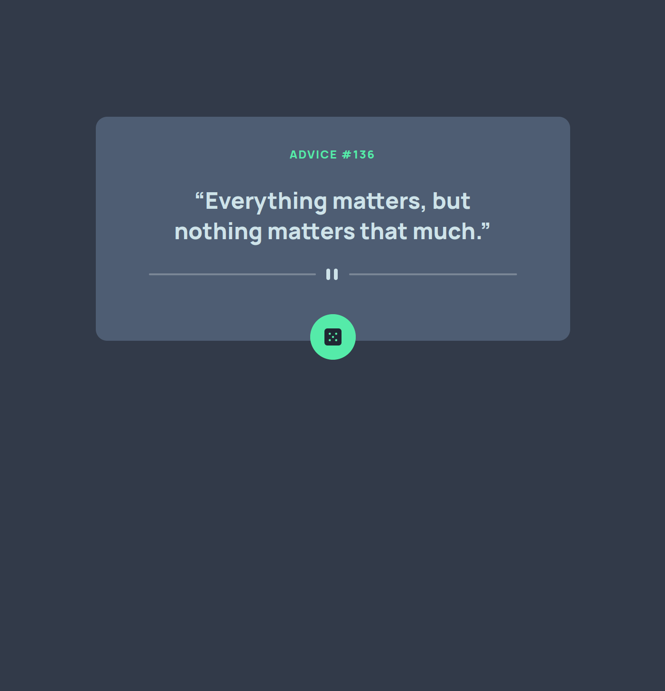

# Advice Gen

---

## 📕 About

Advice Gen is an advice generator app, [based on the Adviceslip API](https://api.adviceslip.com/).

---

## ⚒️ Used Technologies

To develop this app, I used these technologies:

- NextJS (Create Next App)
- Typescript
- TailwindCSS
- Jest for testing

---

## ✨ Features

- Responsivity
- Visualization of a random advice
- Caching with React Query

---

## ⚙️ How to Use

First, clone the repository.

Inside the project folder, run `yarn` or `yarn install` to install the dependencies.

Then, run `yarn dev` to start a local development server.

---

## 🤝 Be a Contributor

Have any idea that can help boost the project, and want to share it? It's simple!

1. Fork the project
2. Modify what you want
3. Commit the changes
4. Open a Pull Request

---

## 🔓 License

This project is under license. [Click here for details](./LICENSE.md).
